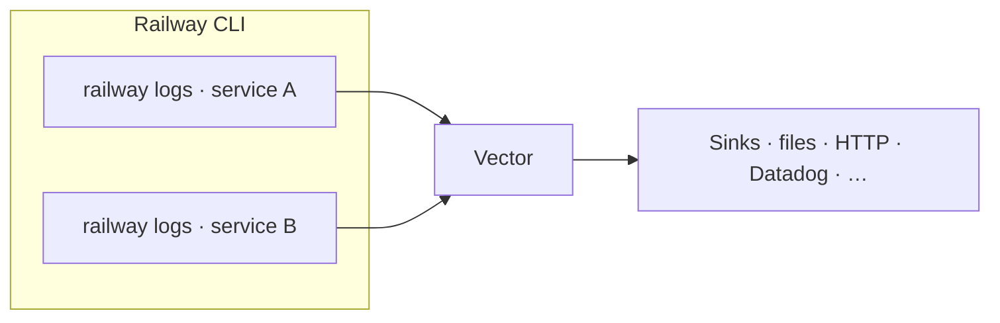

# Railtracks

[](https://go.dev/)
[](https://vector.dev/)

**Bridge [Railway](https://railway.app/) service logs into [Vector](https://vector.dev/) with one process tree.**

Railtracks starts Vector once, then spawns one `railway logs` subprocess per configured service ID. Every stream is multiplexed into Vector’s stdin so you can parse, filter, and ship logs with your existing Vector topology—no extra collectors or sidecars on Railway itself.



---

## Why use this?

- **Single Vector process** — one config, one place to define transforms and sinks.
- **Multi-service** — tail several Railway services in parallel; one JSON config lists them all.
- **Graceful shutdown** — handles `SIGINT` / `SIGTERM` and tears down subprocesses cleanly.
- **Small surface** — a thin Go orchestrator; no log format lock-in beyond what you define in Vector.

---

## Requirements

- [Go](https://go.dev/dl/) **1.24** (or use [mise](https://mise.jdx.dev/) as in this repo)
- [Railway CLI](https://docs.railway.app/develop/cli) installed and able to run `railway logs`
- [Vector](https://vector.dev/docs/) installed and a config file (YAML or TOML) ready to read **stdin** as a source

---

## Quick start

```sh
git clone <repository-url>
cd railtracks
mise install
cp railtracks.example.json railtracks.json
cp .env.example .env
```

Edit **`railtracks.json`**: set `environment`, `service_ids`, and `vector_config`. Put a **`RAILWAY_TOKEN`** in `.env` if the CLI must run non-interactively.

Run the pipeline:

```sh
mise run dev
```

Use another config file:

```sh
CONFIG=./production.json mise run dev
```

---

## Docker

Build the container image:

```sh
mise run docker-build
```

Run it with your local config files passed through environment variables:

```sh
mise run docker-run
```

The image contains:

- `railtracks` compiled from this Go module
- Railway CLI installed with `npm i -g @railway/cli`
- Vector installed from the official Vector APT repository

Runtime files stay outside the image. Keep editing `.env`, `railtracks.json`, and `vector.toml` locally; the Docker entrypoint writes `TRACK_CONFIG` to `/app/railtracks.json` and `VECTOR_CONFIG` to `/app/vector.toml` before starting `railtracks`.

Without mise, pass the config contents yourself:

```sh
docker run --rm \
  --env-file .env \
  -e TRACK_CONFIG="$(cat railtracks.json)" \
  -e VECTOR_CONFIG="$(cat vector.toml)" \
  railtracks:local
```

You can override the generated paths with `TRACK_CONFIG_PATH` and `VECTOR_CONFIG_PATH`. If either env var is empty, the entrypoint falls back to an existing file at that path.

To pin the Railway CLI package during image builds:

```sh
RAILWAY_CLI_VERSION=latest mise run docker-build
```

Sources:

- Railway CLI install: https://docs.railway.app/cli/
- Vector APT install: https://vector.dev/docs/setup/installation/package-managers/apt/

---

## Configuration

`railtracks.json` (or the path passed with `--config` / `CONFIG`) contains the small set of values Railtracks needs:

```json
{
  "environment": "production",
  "service_ids": ["api", "worker"],
  "vector_config": "vector.toml"
}
```

Railtracks starts `vector --config <vector_config>` once, then starts `railway logs --service <service_id> --environment <environment>` for each service id.

See **`railtracks.example.json`** for a full template.

### CLI

```text
railtracks [--config path] [--print-example]
```

- **`--config`** — JSON pipeline config (default: `railtracks.json`)
- **`--print-example`** — print a default JSON example to stdout and exit

---

## Development

```sh
mise run build    # go build → bin/railtracks
mise run check    # go test ./... && go vet ./...
mise run test
mise run fmt
```

GitHub Actions runs the same Go checks on pull requests and pushes to `main`, then builds Linux and macOS binary artifacts. The Docker workflow builds the image on pull requests and publishes to GitHub Container Registry on `main` pushes and `v*.*.*` tags.
